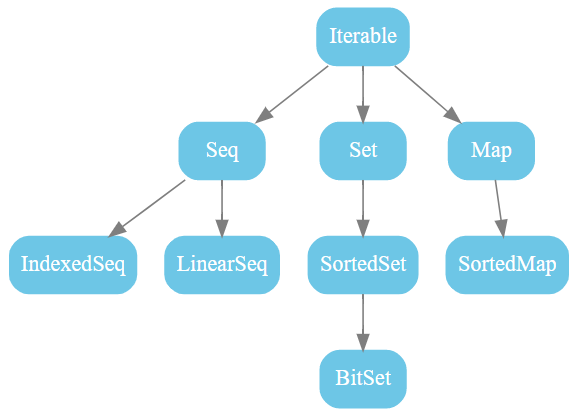
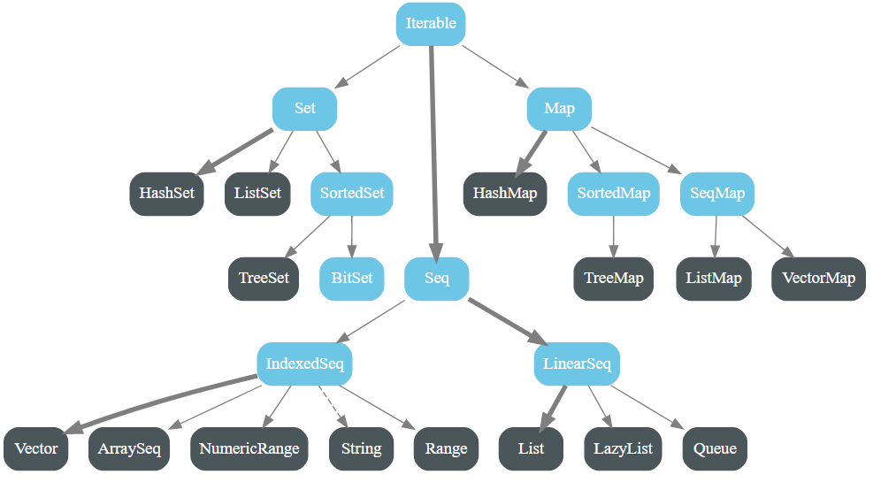
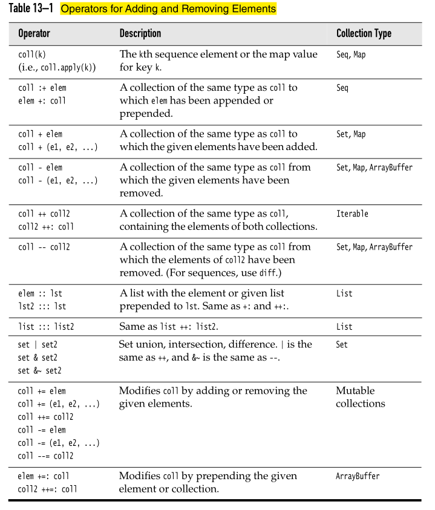

# Scala Tutorial

## Basics 

`object` declaration is commonly known as a singleton object.

Static members (methods or fields) do not exist in Scala. Rather than defining static members, the Scala programmer declares these members in singleton objects.

The package name should be **all lower case**. 

### String

### String Interpolation

introduced in Scala 2.10

`raw` interpolator performs no escaping of literals within the string. For instance,

```scala
scala> s"foo\nbar"
res0: String =
foo
bar

scala> raw"foo\nbar"
res1: String = foo\nbar
```

---

### Regex

How to create a `Regex` object:

- Easiest way, invoke the `.r` method on a String. 
- `import scala.util.matching.Regex`. Then create a `Regex` instance.

Then look for matches.

Example: 

```scala
val numPattern = "[0-9]+".r
// or
val numPattern = new Regex("[0-9]+")

val address = "123 Main Street Suite 101"

val match1 = numPattern.findFirstIn(address)  // Option[String]

val matches = numPattern.findAllIn(address)  // MatchIterator
```

---

### Types

- In Scala, every expression has a type.
- `Any` is a super-type of all other types in Scala.
- The type `Unit` refers to nothing meaningful, which is similarly to `void` in Java.
  - **All functions must return something.** If you do not want to return, return `Unit`. 
  - One instance of `Unit` can be declared literally like `()`.
- `Null` is provided mostly for interoperability with other JVM languages and should almost **never** be used in Scala code. 

---

### Type Inference

For recursive methods, the compiler is **NOT** able to infer a result type. Therefore, you **MUST** specify the return type.

For example:

```scala
// compile error
// Scala compiler could not verify that the type of n * fac(n - 1) is an Int 
def fac(n: Int) = if (n == 0) 1 else n * fac(n - 1)
```

When **NOT** to rely on type inference:

- **Recommended** that you make the type explicit for any APIs that will be exposed to users of your code.
- Type inference can sometimes infer a too-specific type. For example, `var obj = null`. `obj` is Null type, and cannot be reassigned to a different type value.

---

### Default Values

- 0 for numeric types
- false for the Boolean type
- () for the Unit type 
- null for all object types

For generic type, assign it as `_`.

---

### Loop

In Scala, loops are not used as often as in other languages.

#### Break & Continue

Scala has no break or continue. But alternative solutions:

- Use a Boolean control variable.
- Use nested functions — you can return from the middle of a function.
- Use the break method in the Breaks object:

```scala
import scala.util.control.Breaks._

// break
breakable {
  for (...) {
    if (...) break // exits the breakable block
    ...
  }
}

// continue
for (...) {
  breakable {
    if (...) break
    ...
  }
}
```

Here, the control transfer is done by throwing and catching an exception,
so you should **avoid this mechanism when time is of essence**.

#### `for` & `foreach` & `map`

**Recommended** style for writing longer `for` loop is to use curly braces.

```scala
for {
  ...
  ...
}
```

`for/yield` loop (`for` comprehension) without a guard is equivalent to `map`. Guards correspond to `filter`.

Scala compiler translates a `for` loop into a `foreach` method call.

`foreach` VS. `map`:

- `foreach` operates on each element without returning a result.

---

### Functions

A function's name can have characters like +, ++, ~, &,-, --, \, /, :, etc.

The last expression of the block becomes the value that the function returns.

In Scala, you can define a function inside any scope.

#### Methods VS Functions

- A method is a part of a class which has a name, a signature, optionally some annotations, and some bytecode.
- A function is a complete object which can be assigned to a variable.
- In other words, a function, which is defined as a member of some object, is called a method.
- A method operates on an object, but a function does not.
- In Java, imitate functions with static methods.
- **Anything defined with `def` is a method, not a function.**

```scala
// method
def m1(x: Int) = x + x
m1(2)  // 4

// function
// do not have to use val
val f1 = (x: Int) => x + x
f1(2)  // 4

f1  // Int => Int = <function1>
m1  // error: missing argument list for method m1...
```

##### Converting Method into A Function

Method can be converted into a proper function (often referred to as lifting) by calling method with underscore “_” after method name.

```scala
val f2 = m1 _  // Int => Int = <function1>
```

##### When to Use Methods and When Functions

- Use functions if you need to pass them around as parameters.
- Use functions if you want to act on their instances, e.g. `f1.compose(f2)(2)`.
- Use methods if you want to use default values for parameters e.g. `def m1(age: Int = 2) = ...`.
- Use methods if you just need to compute and return.

#### Currying

Currying is the process of turning a function that takes two arguments into a function that takes one argument. That function returns a function that consumes the second argument.

Example:

```scala
// normal function
val mul = (x: Int, y: Int) => x * y
// invoke
mul(6, 7)  // 42

// curry function
val mulOneAtATime = (x: Int) => ((y: Int) => x * y)
// invoke
mulOneAtATime(6)(7)  // 42

// method
def mulOneAtATimeMethod(x: Int)(y: Int) = x * y
```

---

### Return

`return` is not commonly used in Scala, although noting wrong if you use it.

Think of `return` as a kind of break statement for functions, and **only** use it when you want that breakout functionality.

If you use `return` inside a named function, you need to specify its return type when defining the function.

Example:

```scala
def indexOf(str: String, ch: Char): Int = {  // specify Int return type
    var i = 0
    until (i == str.length) {
        if (str(i) == ch) return i
        i += 1
    }
    return -1
}
```

---

### Classes

In Scala, a class is not declared as `public`.

#### `()` of Methods

Good style: 

- Use `()` for mutator methods.
- Drop `()` for accessor methods.

```scala
class Counter {
	private var value = 0  // must initialize the field
	def increment() {value += 1}
	def current = value  // no () here, must call the method without parentheses
}
```

#### Getters & Setters

Fields in classes **automatically** come with getters and setters.

- If the field is private, the getter and setter methods are private.
- If the field is non-private, the getter and setter methods are public.
- If the field is a `val`, **only** a getter is generated. If the value of the property never changes after the object has been constructed, use a `val` field.
- If you do not want any getter or setter, declare the field as `private[this]`. (not commonly used)

#### Primary Constructor

In Scala, every class has a primary constructor.

If there are no parameters after the class name, then the class has a primary constructor with no parameters.

The primary constructor executes all statements in the class definition.

---

### Case Classes

Case classes are good for modeling **immutable** data.

#### Case Classes VS Classes

Differ from standard classes in the following ways: 

- Do not need to write `new` when creating the instance. This is because case classes have an `apply` method by default which takes care of object construction.
- Every case class automatically has `apply` and `unapply` methods.
- Do not need to write getter method in class. You can get through `.` directly. 
- `equals`, `hashCode` and `toString` methods are provided.
- Instances of these classes can be decomposed through pattern matching. 
- **Case classes are compared by structure / value and not by reference.** (see the code below)
- When you create a case class with parameters, the parameters are public `val`s. 

**For standard classes:**

- Primary constructor parameters with `val` and `var` are public. 
- Parameters without `val` or `var` are private values.

```scala
case class Point(x: Int, y: Int)

val point = Point(1, 2)
val anotherPoint = Point(1, 2)
val yetAnotherPoint = Point(2, 2)

if (point == anotherPoint) {
  println(point + " and " + anotherPoint + " are the same.")
} else {
  println(point + " and " + anotherPoint + " are different.")
} // Point(1,2) and Point(1,2) are the same.

if (point == yetAnotherPoint) {
  println(point + " and " + yetAnotherPoint + " are the same.")
} else {
  println(point + " and " + yetAnotherPoint + " are different.")
} // Point(1,2) and Point(2,2) are different.
```

---

### Sealed Classes

Traits and classes can be marked `sealed` which means all subtypes must be declared in the same file. This assures that all subtypes are known.

```scala
sealed abstract class Furniture
case class Couch() extends Furniture
case class Chair() extends Furniture

def findPlaceToSit(piece: Furniture): String = piece match {
  case a: Couch => "Lie on the couch"
  case b: Chair => "Sit on the chair"
}
```

This is useful for pattern matching because we do not need a “catch all” case.

---

### Variables

In functional programming language, it is encouraged to use immutable constants whenever possible. In Scala, use `val` as possible as you can rather that `var`.

#### `val` VS `lazy val` VS `def`

Lazy values are useful to delay costly initialization statements.

Laziness is not cost-free. 

Think of lazy values as halfway between `val` and `def`.

```scala
// Evaluated as soon as words is defined
val words = scala.io.Source.fromFile("/usr/share/dict/words").mkString

// Evaluated the first time words is used
lazy val words = scala.io.Source.fromFile("/usr/share/dict/words").mkString

// Evaluated every time words is used
def words = scala.io.Source.fromFile("/usr/share/dict/words").mkString
```

---

### Traits

- When a trait extends an abstract class, it does not need to implement the abstract members.
- Traits cannot have parameters.

```scala
trait Iterator[A] {
  def hasNext: Boolean
  def next(): A
}


class IntIterator(to: Int) extends Iterator[Int] {
  private var current = 0
  override def hasNext: Boolean = current < to
  override def next(): Int =  {
    if (hasNext) {
      val t = current
      current += 1
      t
    } else 0
  }
}


val iterator = new IntIterator(10)
iterator.next()  // returns 0
iterator.next()  // returns 1
```

#### Trait Extending Classes

Class A extends class B and trait C, trait C extends class D which is the superclass of class B. This situation is OK.

If class B is unrelated to class D, not OK,
multiple inheritance.

#### Self Types

Self type is used to specify what kind of classes can extend this trait.

Example: 

```scala
trait LoggedException extends ConsoleLogger {
    this: Exception =>
        def log() = { log(getMessage()) }
}
```

Only subclasses of Exception can mix in this trait.

Example:

```scala
trait LoggedException extends ConsoleLogger {
    this: { def getMessage(): String } =>
        def log() = { log(getMessage()) }
}
```
Only classes with `getMessage()` method can mix in this trait.

---

### Higher Order Functions

Higher order functions take other functions as parameters or return a function as a result.

```scala
// here, map() is the higher order function
val salaries = Seq(20000, 70000, 40000)
val doubleSalary = (x: Int) => x * 2
val newSalaries = salaries.map(doubleSalary) // List(40000, 140000, 80000)
// or
val newSalaries = salaries.map(x => x * 2)
// or 
val newSalaries = salaries.map(_ * 2)
```

#### A Method that Returns A Function

```scala
def urlBuilder(ssl: Boolean, domainName: String): (String, String) => String = {
  val schema = if (ssl) "https://" else "http://"
  (endpoint: String, query: String) => s"$schema$domainName/$endpoint?$query"
}

val domainName = "www.example.com"
def getURL = urlBuilder(ssl=true, domainName)
val endpoint = "users"
val query = "id=1"
val url = getURL(endpoint, query) // "https://www.example.com/users?id=1": String
```

---

### Companion Objects & Classes

- An object with the same name as a class is called a companion object. 
- Conversely, the class is the object’s companion class. 
- A companion class or object can access the private members of its companion. 
- **NOTE**: If a class or object has a companion, both must be defined in the same file. 
- Use a companion object for methods and values that are not specific to instances of the companion class.
- `static` members in Java are modeled as ordinary members of a companion object in Scala.

---

### Collections



A useful convention if you want to use both mutable and immutable versions of collections is to import just the package `scala.collection.mutable`.

Uniform creation principle: Each Scala collection trait or class has a companion object with an `apply` method for constructing an instance of the collection. 

Use the `==` operator to compare any sequence, set, or map with another collection of the same kind. E.g. `Seq(1, 2, 3) == (1 to 3)  // true`.

#### Mutable 


#### Immutable



Immutable collections are thread safe. **By default, Scala uses immutable collections.** You should use immutable collections in preference.

If elements are repeatable, use `List` or `Seq`.

#### Vector

A `Vector` is the immutable equivalent of an  `ArrayBuffer`: an indexed sequence with
fast random access. Vectors are implemented as trees where each node has up to 32 children. 

#### List

A list is either `Nil` or an object with a  head element and a tail that is again a list.

`::` is right-associative.

The result of `9 :: List(4, 2)` is `List(9, 4, 2)`. **Cannot** `List(4, 2) :: 9`.

**It is more natural to use recursion to traverse a linked list.** For instance, 

```scala
def sum(lst: List[Int]): Int = 
    if (lst == Nil) 0 else lst.head + sum(lst.tail)

// or 
def sum(lst: List[Int]): Int = lst match {
    case Nil => 0
    case head :: tail => head + sum(tail)
}

// actually for this particular example
// you can use
lst.sum
```

#### Set

By default, sets are implemented as hash sets in which elements are organized by the value
of the `hashCode` method.

**Sets actually have order. But the order is not insertion order.**

For linked hash sets, the order is insertion order.

**Finding an element in a hash set is much faster than in an array or list.**

#### Operators 

- Append `(:+)` or prepend `(+:)` to a sequence.
- Add `(+)` to an unordered collection.
- Remove with the `-` operator.
- Use `++` and `--` for bulk add and remove.
- Mutations are `+=` `++=` `-=` `--=`.
- For lists, many Scala programmers prefer the `::` and `:::` operators.
- **Stay away from** `++:` `+=:` `++=:`.



---

### Implicits

How `implicits` works:

If you call a method on a Scala object, and the Scala compiler does not see a definition for that method in the class definition for that object, the compiler will try to convert your object to an instance of a class that does have that method defined.

Take `<string>.toDouble()` as an example. 

1. In Scala, an instance of the `String` class is just a `java.lang.String`, and the `java.lang.String` class does not have a method named `toDouble`. 
2. The compiler will find that `StringOps` class has.
3. And the `StringOps` class has a method that can convert an instance of the `String` class into an instance of the `StringOps` class.
4. The compiler silently performs the conversion of the `String` object into a  `StringOps` object, and then calls the  `toDouble` method on the new object.

#### Implicit Parameters

A method can have an implicit parameter list, marked by the implicit keyword at the start of the parameter list. If the parameters in that parameter list are not passed as usual, Scala will look if it can get an implicit value of the correct type, and if it can, pass it automatically.

```scala
abstract class Monoid[A] {
  def add(x: A, y: A): A
  def unit: A
}

object ImplicitTest {
  implicit val stringMonoid: Monoid[String] = new Monoid[String] {
    def add(x: String, y: String): String = x concat y
    def unit: String = ""
  }
  
  implicit val intMonoid: Monoid[Int] = new Monoid[Int] {
    def add(x: Int, y: Int): Int = x + y
    def unit: Int = 0
  }
  
  def sum[A](xs: List[A])(implicit m: Monoid[A]): A =
    if (xs.isEmpty) m.unit
    else m.add(xs.head, sum(xs.tail))
    
  def main(args: Array[String]): Unit = {
    println(sum(List(1, 2, 3)))       // uses intMonoid implicitly
    println(sum(List("a", "b", "c"))) // uses stringMonoid implicitly
  }
```

---

### Performance

#### By-name Parameters

By-name parameters are only evaluated when used, in contrast to by-value parameters, which is evaluated only once.

prepend `=>` to its type

For example, `def calculate(input: => Int) = input * 37`.

**Using by-name parameters to delay evaluation of a parameter until it is used can help performance if the parameter is computationally intensive to evaluate or a longer-running block of code such as fetching a URL.**

---

### Console Input & Output

Need `import io.StdIn._` before using it.

- `readInt`
- `readDouble`
- `readByte`
- `readShort`
- `readFloat`
- `readLong`
- `readChar`
- `readBoolean`
- `readLine`: can have a parameter as prompt.

---

## Snippets

### Factorial Method

```scala
// nested method
 def factorial(x: Int): Int = {
    def fact(x: Int, accumulator: Int): Int = {
      if (x <= 1) accumulator
      else fact(x - 1, x * accumulator)
    }  
    fact(x, 1)
 }

 println("Factorial of 2: " + factorial(2))
 println("Factorial of 3: " + factorial(3))
```

### Count Frequencies of Letters in a String

```scala
// using a mutable map (not preferred)
// using for loop
val freq = scala.collection.mutable.Map[Char, Int]()
for (c <- "IAmAString") freq(c) = freq.getOrElse(c, 0) + 1

// using a immutable map (preferred)
// using foldLeft
"IAmAString".foldLeft(Map[Char, Int]())({
	(m, c) => m + (c -> (m.getOrElse(c, 0) + 1))
})

// or another style
(Map[Char, Int]() /: "IAmAString") {
	(m, c) => m + (c -> (m.getOrElse(c, 0) + 1))
}
```